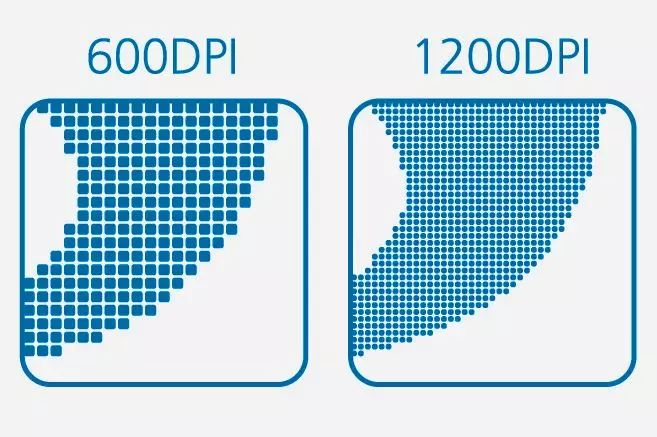

先聊聊熟悉的几个单位

围绕着各种屏幕做设计和开发的人会碰到下面几个单位：in, pt, px, dpi，dip/dp, sp

下面先简单回顾下前四个单位：

“in”

inches的缩写，英寸。就是屏幕的物理长度单位。一英寸等于2.54cm。比如Android手机常见的尺寸有5寸、5.5寸、6寸等，这里的长度都是指手机对角线的长度。

“pt"

“points” 的缩写，点。一个点等于1/72英寸，所以“点”也是个长度单位而已。

"px"

“pixel” 的缩写，像素。是画面显示的基本单位，真实的像素并不是点或者方块（虽然有时这样显示），也没有实际固定长度，只是一个抽象的取样。设计中的像素和实际显示屏上的像素相对应。

屏幕的分辨率一般就描述为“宽向像素数X纵向像素数”。比如 Android手机常见的分辨率有：320 X 480, 480 X 800, 1080 X 1920等。

"dpi"

"dots per inch" 的缩写，“每英寸的像素数”，即像素密度。下图展示了600 dpi和1200 dpi的对比，明显后者的像素更加密集。

安卓手机种类多样，有各种屏幕像素密度。比如120dpi是低密度（ldpi）类型，160dpi 是中密度（mdpi），240dpi是高密度（hdpi)，320dpi是超高密度（xhdpi），480dpi是超超高密度（xxhdpi）。

为什么要引入 dp 这个单位

像素（px）是设计师们熟知的单位，比如画图自定义尺寸的时候就来个宽xx像素乘以高xx像素，好像一直没什么问题。

不过，如果你仔细观察一下就会发现，在做UI设计时，设计工具给出的默认手机尺寸并不是按像素数来计算的。