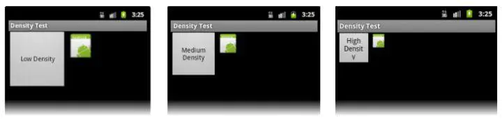
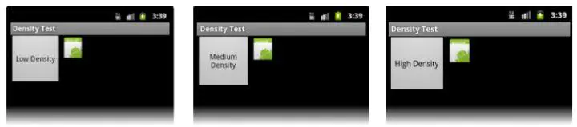
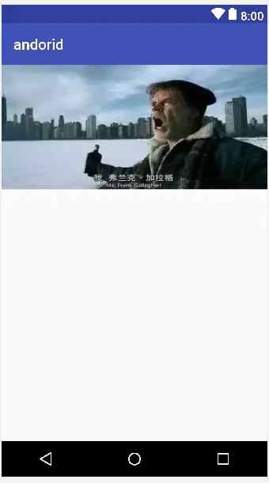
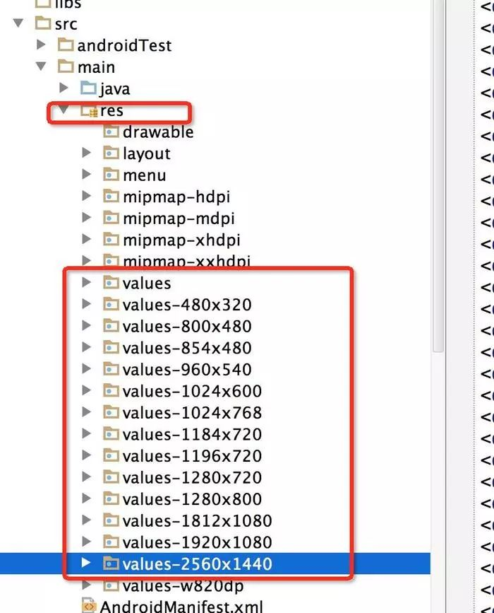
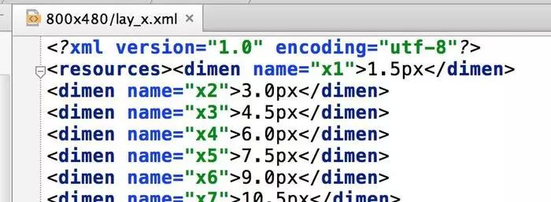
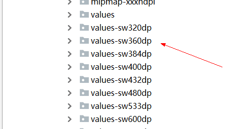
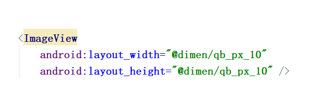
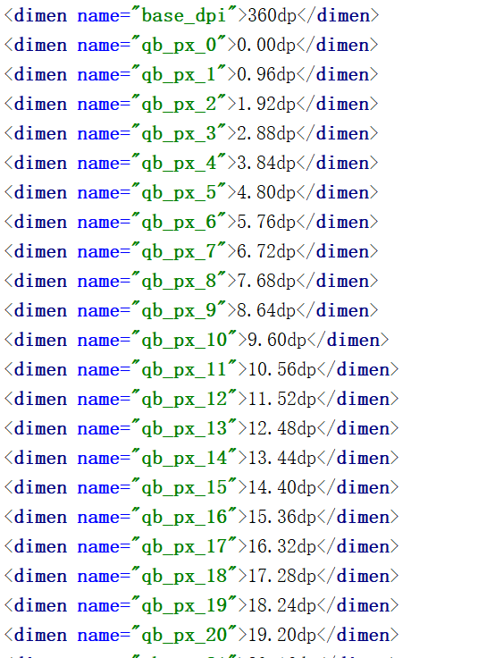

# Android 目前最稳定和高效的UI适配方案 #

Android系统发布十多年以来，关于Android的UI的适配一直是开发环节中最重要的问题，但是我看到还是有很多小伙伴对Android适配方案不了解。
Android适配最核心的问题有两个，其一，就是适配的效率，即把设计图转化为App界面的过程是否高效，其二如何保证实现UI界面在不同尺寸和分辨率的手机中UI的一致性。这两个问题都很重要，一个是保证我们开发的高效，一个是保证我们适配的成效；今天我们就这两个核心的问题来聊一聊Android的适配方案。
首先，大家都知道，在标识尺寸的时候，Android并不推荐我们使用px这个真实像素单位，因为不同的手机之间，分辨率是不同的，比如一个96*96像素的控件在分辨率越来越高的手机上会在整体UI中看起来越来越小。

出现类似于上图这样这样，整体的布局效果可能会变形，所以px这个单位在布局文件中是不推荐的。

## Dp直接适配 ##

针对这种情况，Android推荐使用dp作为尺寸单位来适配UI.

那么什么是dp？dp指的是设备独立像素，以dp为尺寸单位的控件，在不同分辨率和尺寸的手机上代表了不同的真实像素，比如在分辨率较低的手机中，可能1dp=1px,而在分辨率较高的手机中，可能1dp=2px，这样的话，一个96*96dp的控件，在不同的手机中就能表现出差不多的大小了。那么这个dp是如何计算的呢？ 我们都知道一个公式： px = dp(dpi/160) 系统都是通过这个来判断px和dp的数学关系，

那么这里又出现了一个问题，dpi是什么呢？

dpi是像素密度，指的是在系统软件上指定的单位尺寸的像素数量，它往往是写在系统出厂配置文件的一个固定值。

我为什么要强调它是软件系统上的概念？因为大家买手机的时候，往往会听到另一个叫ppi的参数，这个在手机屏幕中指的也是像素密度，但是这个是物理上的概念，它是客观存在的不会改变。dpi是软件参考了物理像素密度后，人为指定的一个值，这样保证了某一个区间内的物理像素密度在软件上都使用同一个值。这样会有利于我们的UI适配。

比如，几部相同分辨率不同尺寸的手机的ppi可能分别是是430,440,450,那么在Android系统中，可能dpi会全部指定为480.这样的话，dpi/160就会是一个相对固定的数值，这样就能保证相同分辨率下不同尺寸的手机表现一致。

而在不同分辨率下，dpi将会不同，比如：

...|1080 * 720|1920 * 1080
--|:--:|--:
dpi|320|480
dpi/160|2|3
根据上面的表格，我们可以发现，720P,和1080P的手机，dpi是不同的，这也就意味着，不同的分辨率中，1dp对应不同数量的px(720P中，1dp=2px，1080P中1dp=3px)，这就实现了，当我们使用dp来定义一个控件大小的时候，他在不同的手机里表现出相应大小的像素值。

我们可以说，通过dp加上自适应布局和weight比例布局可以基本解决不同手机上适配的问题，这基本是最原始的Android适配方案。

这种方式存在两个小问题，第一，这只能保证我们写出来的界面适配绝大部分手机，部分手机仍然需要单独适配，为什么dp只解决了90%的适配问题，因为并不是所有的1080P的手机dpi都是480，比如Google 的Pixel2（1920*1080）的dpi是420，也就是说，在Pixel2中，1dp=2.625px,这样会导致相同分辨率的手机中，这样，一个100dp*100dp的控件，在一般的1080P手机上，可能都是300px,而Pixel 2 中 ，就只有262.5px,这样控件的实际大小会有所不同。

为了更形象的展示，假设我们在布局文件中把一个ImageView的宽度设置为360dp,那么在下面两张图中表现是不一样的：

图一是1080P,480dpi的手机，图二是1080P,420dpi的手机

从上面的布局中可以看到，同样是1080P的手机，差异是比较明显的。在这种情况下，我们的UI可能需要做一些微调甚至单独适配。

第二个问题，这种方式无法快速高效的把设计师的设计稿实现到布局代码中，通过dp直接适配，我们只能让UI基本适配不同的手机,但是在设计图和UI代码之间的鸿沟，dp是无法解决的，因为dp不是真实像素。而且，设计稿的宽高往往和Android的手机真实宽高差别极大，以我们的设计稿为例，设计稿的宽高是375px*750px，而真实手机可能普遍是1080*1920,

那么在日常开发中我们是怎么跨过这个鸿沟的呢？基本都是通过**百分比**啊，或者通过估算，或者设定一个规范值等等。总之，当我们拿到设计稿的时候，设计稿的ImageView是128px*128px，当我们在编写layout文件的时候，却不能直接写成128dp*128dp。在把设计稿向UI代码转换的过程中，我们需要耗费相当的精力去转换尺寸，这会极大的降低我们的生产力，拉低开发效率。

## 宽高限定符适配 ##

为了高效的实现UI开发，出现了新的适配方案，我把它称作宽高限定符适配。简单说，就是穷举市面上所有的Android手机的宽高像素值：

设定一个基准的分辨率，其他分辨率都根据这个基准分辨率来计算，在不同的尺寸文件夹内部，根据该尺寸编写对应的dimens文件。

比如以480x320为基准分辨率
宽度为320，将任何分辨率的宽度整分为320份，取值为x1-x320
高度为480，将任何分辨率的高度整分为480份，取值为y1-y480
那么对于800*480的分辨率的dimens文件来说，
x1=(480/320)*1=1.5px
x2=(480/320)*2=3px

这个时候，如果我们的UI设计界面使用的就是基准分辨率，那么我们就可以按照设计稿上的尺寸填写相对应的dimens引用了,而当APP运行在不同分辨率的手机中时，这些系统会根据这些dimens引用去该分辨率的文件夹下面寻找对应的值。这样基本解决了我们的适配问题，而且极大的提升了我们UI开发的效率。
但是这个方案有一个致命的缺陷，那就是需要精准命中才能适配，比如1920x1080的手机就一定要找到1920x1080的限定符，否则就只能用统一的默认的dimens文件了。而使用默认的尺寸的话，UI就很可能变形，简单说，就是容错机制很差。

不过这个方案有一些团队用过，我们可以认为它是一个比较成熟有效的方案了。

## UI适配框架（已停止维护） ##

使用方法也很简单：
第一步：
在你的项目的AndroidManifest中注明你的设计稿的尺寸。

    <meta-data android:name="design_width" android:value="768">
    </meta-data>
    <meta-data android:name="design_height" android:value="1280">
    </meta-data>

第二步：
让你的Activity继承自AutoLayoutActivity.
然后我们就可以直接在布局文件里面使用具体的像素值了，比如，设计稿上是96*96,那么我们可以直接写96px，APP运行时，框架会帮助我们根据不同手机的具体尺寸按比例伸缩。
这可以说是一个极好的方案，因为它在宽高限定符适配的基础上更进一步，并且解决了容错机制的问题，可以说完美的达成了开发高效和适配精准的两个要求。
但是我们能够想到，因为框架要在运行时会在onMeasure里面做变换，我们自定义的控件可能会被影响或限制，可能有些特定的控件，需要单独适配，这里面可能存在的暗坑是不可预见的，还有一个比较重要的问题，那就是整个适配工作是有框架完成的，而不是系统完成的，一旦使用这个框架，未来一旦遇到很难解决的问题，替换起来是非常麻烦的，而且项目一旦停止维护，后续的升级就只能靠你自己了，这种代价团队能否承受？已经停止维护了。
不过仅仅就技术方案而言，不可否认，这是一个很好的开源项目。

## 今日头条适配方案（更新） ##

文章链接 <https://mp.weixin.qq.com/s?__biz=MzI1MzYzMjE0MQ==&mid=2247484502&idx=2&sn=a60ea223de4171dd2022bc2c71e09351&scene=21#wechat_redirect>之前确实没有接触过，我简单看了一遍，可以说，这也是相对比较完美的方案，我先简单说一下这个方案的思路，它是通过修改density值，强行把所有不同尺寸分辨率的手机的宽度dp值改成一个统一的值，这样就解决了所有的适配问题。

比如，设计稿宽度是360px，那么开发这边就会把目标dp值设为360dp，在不同的设备中，动态修改density值，从而保证(手机像素宽度)px/density这个值始终是360dp,这样的话，就能保证UI在不同的设备上表现一致了。

这个方案侵入性很低，而且也没有涉及私有API，应该也是极不错的方案，我暂时也想不到强行修改density是否会有其他影响，既然有今日头条的大厂在用，稳定性应当是有保证的。

但是根据我的观察，这套方案对老项目是不太友好的，因为修改了系统的density值之后，整个布局的实际尺寸都会发生改变，如果想要在老项目文件中使用，恐怕整个布局文件中的尺寸都可能要重新按照设计稿修改一遍才行。因此，如果你是在维护或者改造老项目，使用这套方案就要三思了。

小结

讨论的上述几种适配方案都是可以实际用于开发中的比较成熟的方案，而且确实有很多开发者正在使用。不过由于他们各自都存在一些缺陷，所以我们使用了上述方案后还需要花费额外的精力着手解决这些可能存在的缺陷。

那么，是否存在一种相对比较完美，没有明显的缺陷的方案呢？

## smallestWidth适配 ##

smallestWidth适配，或者叫sw限定符适配。指的是Android会识别屏幕可用高度和宽度的最小尺寸的dp值（其实就是手机的宽度值），然后根据识别到的结果去资源文件中寻找对应限定符的文件夹下的资源文件。

这种机制和上文提到的宽高限定符适配原理上是一样的，都是系统通过特定的规则来选择对应的文件。

举个例子，小米5的dpi是480,横向像素是1080px，根据px=dp(dpi/160)，横向的dp值是1080/(480/160),也就是360dp,系统就会去寻找是否存在value-sw360dp的文件夹以及对应的资源文件。

smallestWidth限定符适配和宽高限定符适配最大的区别在于，前者有很好的容错机制，如果没有value-sw360dp文件夹，系统会向下寻找，比如离360dp最近的只有value-sw350dp，那么Android就会选择value-sw350dp文件夹下面的资源文件。这个特性就完美的解决了上文提到的宽高限定符的容错问题。

这套方案是上述几种方案中最接近完美的方案。

首先，从开发效率上，它不逊色于上述任意一种方案。根据固定的放缩比例，我们基本可以按照UI设计的尺寸不假思索的填写对应的dimens引用。
我们还有以375个像素宽度的设计稿为例，在values-sw360dp文件夹下的dimens文件应该怎么编写呢？

这个文件夹下，意味着手机的最小宽度的dp值是360，我们把360dp等分成375等份，每一个设计稿中的像素，大概代表smallestWidth值为360dp的手机中的0.96dp，那么接下来的事情就很简单了，假如设计稿上出现了一个10px*10px的ImageView,那么，我们就可以不假思索的在layout文件中写下对应的尺寸。

而这种diemns引用，在不同的values-sw\<N\>dp文件夹下的数值是不同的，比如values-sw360dp和values-sw400dp,

当系统识别到手机的smallestWidth值时，就会自动去寻找和目标数据最近的资源文件的尺寸。

其次，从稳定性上，它也优于上述方案。原生的dp适配可能会碰到Pixel 2这种有些特别的手机需要单独适配，但是在smallestWidth适配中，通过计算Pixel 2手机的的smallestWidth的值是411，我们只需要生成一个values-sw411dp(或者取整生成values-sw410dp也没问题)就能解决问题。

smallestWidth的适配机制由系统保证，我们只需要针对这套规则生成对应的资源文件即可，不会出现什么难以解决的问题，也根本不会影响我们的业务逻辑代码，而且只要我们生成的资源文件分布合理，，即使对应的smallestWidth值没有找到完全对应的资源文件，它也能向下兼容，寻找最接近的资源文件。

当然，smallestWidth适配方案有一个小问题，那就是它是在Android 3.2 以后引入的，Google的本意是用它来适配平板的布局文件（但是实际上显然用于diemns适配的效果更好），不过目前所有的项目应该最低支持版本应该都是4.0了（糗事百科这么老的项目最低都是4.0哦），所以，这问题其实也不重要了。

还有一个缺陷我忘了提，那就是多个dimens文件可能导致apk变大，这是事实，根据生成的dimens文件的覆盖范围和尺寸范围，apk可能会增大300kb-800kb左右，目前糗百的dimens文件大小是406kb，我认为这是可以接受的。
